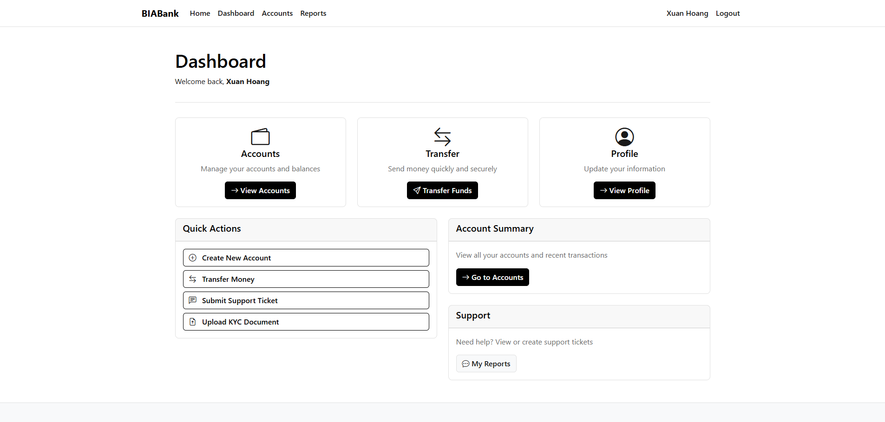
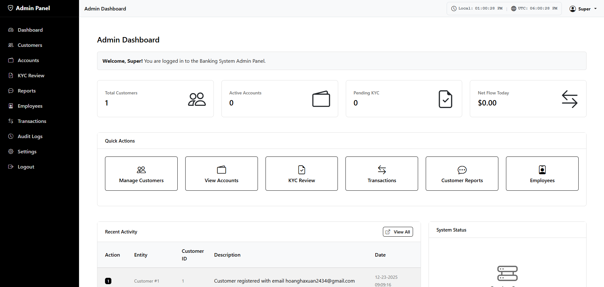
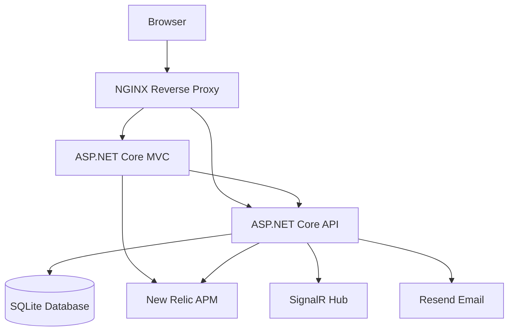

# BIABank - Banking System Simulation

A comprehensive banking system simulation built with ASP.NET Core 9.0, featuring customer account management, transactions, KYC verification, and an admin portal. The system implements clean architecture principles with JWT authentication and real-time notifications.

## Tech Stack

| Layer | Technology |
|-------|------------|
| **Backend** | ASP.NET Core 9.0, Entity Framework Core 9.0, SQLite |
| **Frontend** | ASP.NET Core MVC 9.0, Razor Views, Bootstrap |
| **Authentication** | JWT Bearer Tokens |
| **Real-time** | SignalR |
| **Infrastructure** | Docker, Docker Compose, Nginx |
| **Monitoring** | New Relic APM |
| **Email** | Resend API |

## Features

### Core Banking Features
- **Account Management**: Create, view, and manage bank accounts
- **Transactions**:
  - Deposits  
  - Withdrawals  
  - Fund transfers  
  - Bill payments  
- **Customer Management**: Full customer profile management
- **Transaction History**: Audit trail of all financial operations
- **Reports & Analytics**: Financial reports and operational insights

### Customer Features
- **Account Management**: Open and manage personal bank accounts
- **Transactions**: Perform deposits, withdrawals, transfers, and bill payments
- **KYC Verification**: Customer identity verification system
- **Real-time Notifications**: Instant transaction alerts via SignalR
- **Transaction History**: View detailed transaction records



### Admin Portal
- **User Management**: Manage customer accounts, roles, and permissions
- **Operations Monitoring**: Track and audit all banking activities
- **KYC Review**: Approve or reject customer verification requests
- **System Administration**: Configure system settings and access controls
- **Reporting & Analytics**: Monitor financial and operational performance



### Security Features

| Category | Implementation |
|----------|----------------|
| **Authentication** | JWT Bearer Tokens with issuer/audience validation |
| **Authorization** | Role-Based Access Control (RBAC) + Permission-based policies |
| **Rate Limiting** | Global: 100 req/min, Auth: 10 req/min, Transactions: 20 req/min |
| **Password Security** | Secure hashing with configurable password policies |
| **Transport Security** | SSL/TLS (HTTPS) via Nginx reverse proxy |
| **API Security** | CORS policy, SQL injection prevention via EF Core |

**Permission Policies:**
- `DashboardView` - Access to admin dashboard
- `CustomerRead` / `CustomerManage` - Customer data access
- `KycRead` / `KycReview` - KYC verification workflow
- `TransactionRead` - Transaction history access

### Technical Features
- Responsive web interface
- Real-time updates using SignalR
- Docker containerization
- Environment-based configuration
- Database migrations
- Nginx reverse proxy
- Email notifications via Resend
- Application Performance Monitoring (APM) via New Relic
- Secure API architecture with MVC pattern

## Architecture
The application follows a clean architecture pattern with clear separation of concerns:



## Clean Architecture Layers

- **Presentation**: MVC Web App (Razor Views, Controllers)
- **Application**: Business logic, services, use cases, DTOs
- **Domain**: Core entities, value objects, business rules
- **Infrastructure**: EF Core, SQLite, Resend, external integrations

## Configuration

### Environment Variables

Create a `.env` file in the root directory with the following variables:

```env
# JWT Configuration
JWT_SECRET_KEY=your-secret-key-here

# Resend Email Configuration
RESEND_API_KEY=your-resend-api-key
RESEND_FROM_EMAIL=noreply@yourdomain.com
RESEND_FROM_NAME=BIABank

# New Relic Configuration
NEW_RELIC_LICENSE_KEY=your-new-relic-license-key
NEW_RELIC_API_KEY=your-new-relic-api-key

# Application Settings
APP_BASE_URL=https://yourdomain.com
```
### Database Connection

The application uses SQLite by default. The connection string is configured in:
- **Development**: `appsettings.Development.json`
- **Production**: Docker environment variables

### New Relic Monitoring

The application includes New Relic APM integration for performance monitoring.

**Setup:**
1. Get your New Relic license key and API key from your [New Relic account](https://one.newrelic.com/)
2. Add keys to your `.env` file:
   ```env
   NEW_RELIC_LICENSE_KEY=your-license-key
   NEW_RELIC_API_KEY=your-api-key
   ```
3. Build the base image first:
   ```bash
   docker-compose build dotnet-newrelic-base
   ```

**Monitored Applications:**
- `BIABank-API` - Backend API service
- `BIABank-MVC` - Frontend web application

## Getting Started

### Prerequisites

- [.NET 9.0 SDK](https://dotnet.microsoft.com/download/dotnet/9.0)
- [Docker Desktop](https://www.docker.com/get-started)

### Quick Start with Docker (Recommended)

1. **Clone the repository**
```bash
git clone https://github.com/xuanhoang24/BIABanking
cd BIABanking
```

2. **Configure environment variables**

Create a `.env` file in the root directory (see [Configuration → Environment Variables](#environment-variables)).

For development, create a `docker-compose.override.yml` file:
```yaml
services:
  api:
    ports:
      - "5000:8080"
    environment:
      - ASPNETCORE_ENVIRONMENT=Development / Production
  web:
    ports:
      - "7000:8080"
    environment:
      - ASPNETCORE_ENVIRONMENT=Development / Production
```

3. **Run with Docker Compose**

For development (without nginx):
```bash
docker-compose up -d
```

For production (with nginx and SSL):
```bash
docker-compose --profile prod up -d
```

4. **Access the application**

**Development mode:**
- Web Application: http://localhost:7000
- Admin Portal: http://localhost:7000/Admin
- API Base: http://localhost:5000

**Production mode (with nginx):**
- Web Application: https://localhost (or https://biabanking.site)
- Admin Portal: https://localhost/Admin (or https://biabanking.site/Admin)
- API Base: https://localhost/api (or https://biabanking.site/api)

> **Note**: The API doesn't have a root landing page. Use the web application to interact with the system, or access specific API endpoints like `/api/auth/login`.

### Default Accounts

| Role | Email | Password |
|------|-------|----------|
| **Admin** | admin@biabank.com | IDontKnowWhyISetThisPasswordSoLong* |
| **Manager** | manager@biabank.com | IDontKnowWhyISetThisPasswordSoLong* |
| **KYC Reviewer** | kyc@biabank.com | IDontKnowWhyISetThisPasswordSoLong* |

## Support
For issues and questions, please open an issue in the repository.